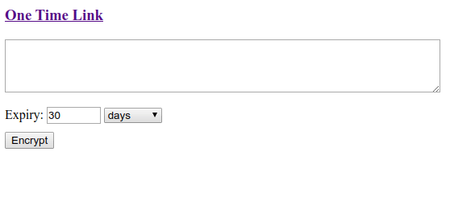

# one-time-link
[](https://travis-ci.org/davidmoten/one-time-link)<br/>
[](https://maven-badges.herokuapp.com/maven-central/com.github.davidmoten/one-time-link)<br/>

A Java webapp that encrypts a secret in the browser and stores encrypted information on the server (without the secret) that can only be read once by the link. That link is the link you would pass to an associate preferrably via some secure protocol (like WhatsApp). The advantage of passing a one-time link is that even if someone gets access to the history of your messages they won't get access to the secret.

**Features**
* uses AES 256 bit CCM encryption ([Stanford Javascript Crypto Library](https://bitwiseshiftleft.github.io/sjcl/)
* self-contained war that saves encrypted messages to the file system

Status: *Deployed to Maven Central*

## Demo


## How to run locally
```
mvn jetty:run
```
Then go to [http://localhost:8080](http://localhost:8080).

## How to deploy to a java servlet container
To build:

```
mvn clean install
```
Then deploy `target/one-time-link*.war` to your servlet container (Tomcat, Jetty, etc).

Encrypted values are stored on the server file system in the `java.io.tmpdir` directory (`/tmp` on Linux).

## Security considerations
Of course this application is ALL about security!

Important things to note:

* AES 256 is considered strong enough for top secret encryption by the NSA
* The server side never sees the unencrypted value nor the secret key used for the encryption
* Sending a one-time use link by email is problematic because a man-in-the-middle attack might intercept an email, use the link, and create a new link from the secret to pass on to the recipient in the edited email. Ideally your communication channel will be secure enough that man-in-the-middle attacks are not possible.
* The message key and the password are 16 characters long generated from random lower case and upper case letters (2.8 x 10<sup>27</sup> variations). 

## AWS
Discussion of a scalable AWS implementation is [here](src/docs/AWS.md).


